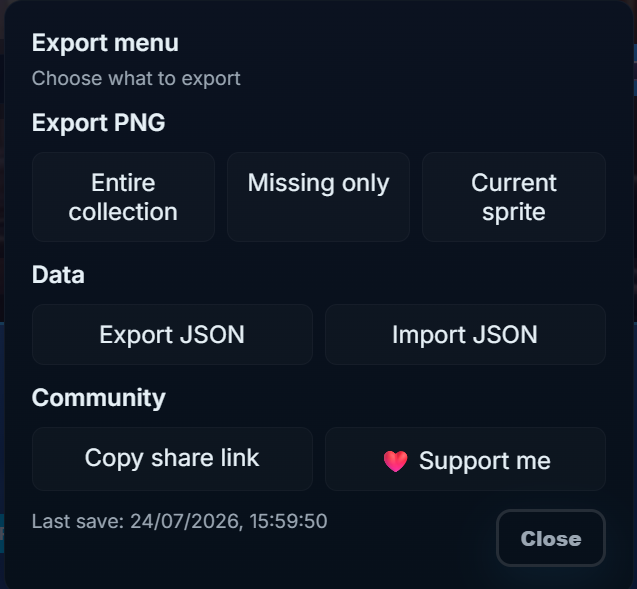
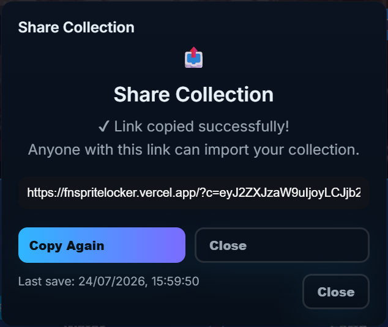
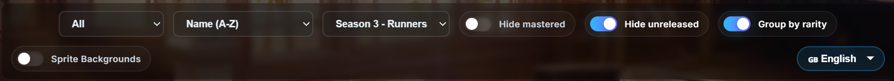
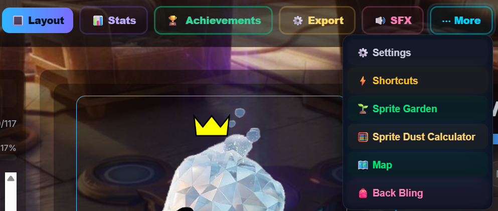
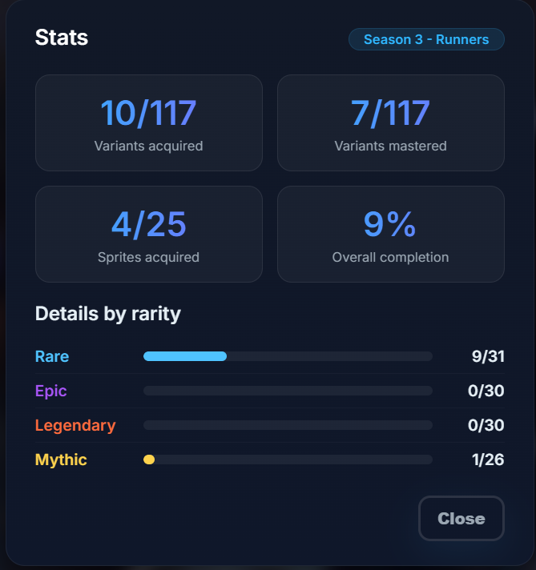

# 🎮 Fortnite Sprite Locker

---

<p align="center">

🏠 **README** •
🚀 [Installation](docs/INSTALLATION.md) •
🎮 [Usage](docs/USAGE.md) •
✨ [Features](docs/FEATURES.md) •
📤 [Share & Export](docs/SHARE_AND_EXPORT.md) •
🎨 [Customization](docs/CUSTOMIZATION.md) •
📂 [Project Structure](docs/PROJECT_STRUCTURE.md) •
⚙️ [Technical](docs/TECHNICAL.md) •
❓ [FAQ](docs/FAQ.md) •
🗺️ [Roadmap](docs/ROADMAP.md)

</p>

---

<div align="center">

# 🎮 Fortnite Sprite Locker


<p align="center">
   
   
  
</p>

### The ultimate Fortnite Chapter 7 Sprite Collection Tracker

Track every Sprite, unlock every variant, monitor your progress and share your collection — all offline.

**Created by Paul**

**👉 [Try it now!](https://fnspritelocker.fabiojava.it/)**

---

## 🌐 Live Demos

[](https://fnspritelocker.fabiojava.it/)
[](https://fnspritelocker.vercel.app/)
[](https://mrpaulgaming.github.io/fnspritelocker/)
> 💡 **Tip:** They works exactly the same, use the one that works best on your device!

</div>

---

## 📑 Table of Contents

- 📸 [Screenshots](#-screenshots)
- ✨ [Features](#-features)
- 🚀 [Quick Start](#-quick-start)
- 📚 [Documentation](#-documentation)
- 🎯 [Use Cases](#-use-cases)
- 🛠️ [Built With](#️-built-with)
- 📂 [Project Structure](#-project-structure)
- 🤖 [AI Assistance](#-ai-assistance)
- 🗺️ [Roadmap](#️-roadmap)
- 🤝 [Contributing](#-contributing)
- 📧 [Contact](#-contact)

---

## 📸 Screenshots

### Main Interface


---

| Grid View | Export | Share |
|-----------|--------|-------|
|  |  |  |

| Filters and more | Statistics |
|----------|------------|
|   | 

---

# ✨ Features

| Feature | Description |
|---------|-------------|
| **🗂️ Collection Management** | Track every Sprite and variant |
| **⭐ Mastery System** | Mark completed Sprites and their variations with a crown |
| **📊 Statistics** | Real-time completion tracking |
| **🔲 Locker & Grid View** | Two different viewing modes |
| **🔍 Filters & Search** | Find any Sprite instantly |
| **📋 Sort & Group** | Sort by name, rarity, completion or last updated |
| **📤 PNG Export** | Export beautiful collection images |
| **💾 JSON Backup** | Import and export your progress |
| **🔗 Share Collection** | Share your collection with one URL |
| **🎵 Background Music** | Optional Fortnite lobby music |
| **📱 Responsive Design** | Desktop, tablet and mobile support |
| **🌐 Multi-language** | Full support for Italian, English, Spanish and French |
| **🎉 Completion Effects (SFX)** | Confetti, sprite rain and dance video when you complete the collection |
| **🎥 Animated Sprites** | Some basic sprites feature animated videos when SFX is enabled |
| **🔄 Season 4 (Override)** | Full support for Season 4 Sprites and variants |
| **🌱 Sprite Garden** | A beautiful, interactive garden showcasing all your collected Sprites |
| **📋 Lobby Codes S4** | View and copy special codes to unlock exclusive rewards |
| **🗺️ Interactive Map** | Draw lines, place markers (Chests, Vaults, Cheat Codes, etc.) – all anchored to the map even when zooming or panning |
| **🕹️ Retro Mode** | Activate a pixel-art style interface (Season 4 only) |
| **🧮 Sprite Dust Calculator** | Plan your resummons with cost calculation and missing sprite dust tracking |
| **🎒 Mastery Pod** | Visualize all your mastered sprites in a special back bling view |
| **⚡ Override List** | Browse all Season 4 Override abilities with descriptions and icons (press `O`) |
| **⚙️ Settings & Sprite Companion** | Adjust volume, choose a floating sprite companion that bounces around your screen, and toggle it on/off |

---

## ⌨️ Shortcuts (available on both PC and mobile, only PC ones here below)

| Shortcut | Action |
|----------|--------|
| `←` / `→` | Navigate between sprites |
| `Space` | Toggle the selected variant (acquire/remove) |
| `M` | Play / Pause music |
| `Shift + M` | Toggle “Mastered” for the current sprite |
| `G` | Toggle Grid / Locker view |
| `S` | Focus the search bar |
| `I` | Open Statistics |
| `E` | Open the Export menu |
| `J` | Open the Sprite Garden |
| `K` | Open the Interactive Map |
| `P` | Open Mastery Pod |
| `C` | Open Sprite Dust Calculator |
| `O` | Open the Override List (Season 4 abilities) |
| `L` | Open Lobby Codes |
| `?` | Open the Keyboard Shortcuts menu |
| `↑ ↑ ↓ ↓ ← → ← → b a` | Quickly switch seasons (Konami Code) |
| `Ctrl + Alt + R` | Toggle Retro Mode (Season 4 only) |
| `Esc` | Close any modal or blur the input field |

All shortcuts are available from anywhere in the app (except when typing in input fields).

---

# 🚀 Quick Start

## Clone the repository

```bash
git clone https://github.com/mrpaulgaming/fnspritelocker.git
```

or simply download the ZIP archive.

## Run the project

Open:

```text
index.html
```

No installation.

No dependencies.

No server.

Everything runs locally inside your browser.

---

# 📚 Documentation

Detailed documentation is available inside the **docs/** folder.

- 📖 FEATURES.md
- 🚀 INSTALLATION.md
- 🎮 USAGE.md
- 📤 SHARE_AND_EXPORT.md
- 🎨 CUSTOMIZATION.md
- 📂 PROJECT_STRUCTURE.md
- ⚙️ TECHNICAL.md
- ❓ FAQ.md
- 🗺️ ROADMAP.md

---

# 🎯 Use Cases

### 🎮 Fortnite Players

- Track every collected Sprite
- Complete every variant
- Monitor overall completion
- Compare collections with friends

### 🎥 Content Creators

- Export collection images
- Showcase progress
- Share collection links

### 👨‍💻 Developers

- Learn SPA architecture
- Study LocalStorage usage
- Explore CSS animations
- Understand state management

---

# 🛠️ Built With

| Technology | Purpose |
|------------|---------|
| HTML5 | Semantic structure |
| CSS3 | Responsive UI & animations |
| JavaScript (ES6+) | Application logic |
| LocalStorage | Persistent saves |
| html2canvas | PNG Export |
| Twemoji | Emoji rendering |

---

# 📂 Project Structure

```text
fortnite-sprite-locker/
│
├── index.html                 # Main application (all-in-one)
├── README.md                  # This file
├── qr-code.png                # Static QR code image for the modal
│
├── assets/                    # All media resources
│   ├── sprites/               # Sprite images (PNG, named by ID)
│   ├── icons/                 # Icons (logo, GitHub, etc.)
│   ├── ui/                    # UI elements (background, mastered crown, dust)
│   └── audios/                # Background music (lobby-music.mp3)
│
├── docs/                      # Detailed documentation (Markdown)
│   ├── FEATURES.md
│   ├── INSTALLATION.md
│   ├── USAGE.md
│   ├── SHARE_AND_EXPORT.md
│   ├── CUSTOMIZATION.md
│   ├── PROJECT_STRUCTURE.md
│   ├── TECHNICAL.md
│   ├── FAQ.md
│   └── ROADMAP.md
│
└── screenshots/               # Screenshots used in the README
    ├── locker-view.png
    ├── grid-view.png
    ├── export-menu.png
    ├── share-menu.png
    ├── filters.png
    └── stats.png
	└── buttons.png
```

---

# 🤖 AI Assistance

AI tools (including DeepSeek) assisted during development for:

- 🐛 Bug fixing
- 🎨 UI/UX improvements
- ⚡ Performance optimization
- 📝 Documentation

Final implementation and project design were manually developed and reviewed.

---

# 🗺️ Roadmap

| Feature | Status |
|---------|--------|
| Light Theme | 📋 Planned |
| PDF Export | 📋 Planned |
| Achievement System | ✅ (Partly) Done |
| Cloud Backup | 📋 Planned |
| Multi-season Support | ✅ Done |
| Mobile App | ✅ (Partly) Done |

See **ROADMAP.md** for the complete roadmap.

---

# 🤝 Contributing

Contributions are welcome!

1. Fork the repository
2. Create a new branch
3. Commit your changes
4. Open a Pull Request

---

# 📧 Contact

**Developer:** Paul

- 📺 YouTube: **[@MrPaulGaming](https://www.youtube.com/@MrPaulGaming)**
- 🐙 GitHub: **[mrpaulgaming/fnspritelocker](https://github.com/mrpaulgaming/fnspritelocker)**
- 🐞 Issues: [GitHub Issues](https://github.com/mrpaulgaming/fnspritelocker/issues)

---

# ⭐ Support

If you enjoy this project:

- ⭐ Star the repository
- 📢 Share it with your friends
- 🐛 Report bugs
- 💡 Suggest new features

---

<div align="center">

**Built with ❤️ using HTML, CSS and JavaScript**

© 2026 Paul

</div>