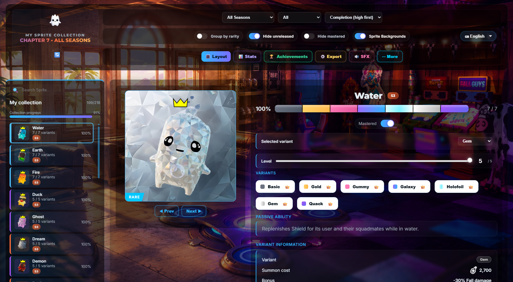
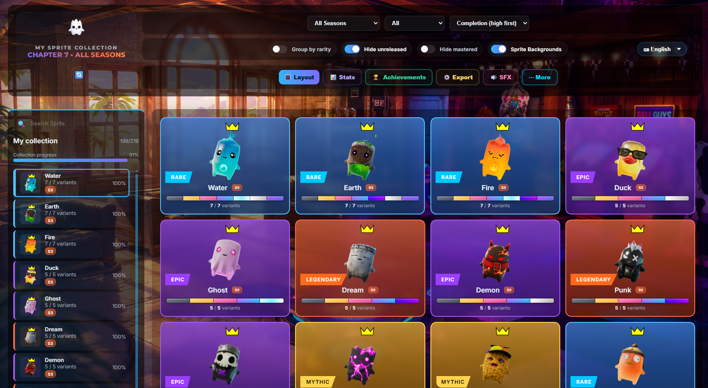

# 🎮 Fortnite Sprite Locker

<div align="center">


### The ultimate Fortnite Chapter 7 • Season 3 Sprite Collection Tracker

Track every Sprite, unlock every variant, monitor your progress and share your collection — all offline.

**Created by Paolo**

</div>

---

## 📑 Table of Contents

- [📸 Screenshots](#-screenshots)
- [✨ Features](#-features)
- [🚀 Quick Start](#-quick-start)
- [📚 Documentation](#-documentation)
- [🎯 Use Cases](#-use-cases)
- [🛠️ Built With](#️-built-with)
- [📂 Project Structure](#-project-structure)
- [🤖 AI Assistance](#-ai-assistance)
- [🗺️ Roadmap](#️-roadmap)
- [🤝 Contributing](#-contributing)
- [📄 License](#-license)
- [📧 Contact](#-contact)

---

# 📸 Screenshots

| Locker View | Grid View |
|--------------|-----------|
|  |  |

---

# ✨ Features

| Feature | Description |
|---------|-------------|
| 🗂️ Collection Management | Track every Sprite and variant |
| ⭐ Mastery System | Mark completed Sprites with a crown |
| 📊 Statistics | Real-time completion tracking |
| 🔲 Locker & Grid View | Two different viewing modes |
| 🔍 Filters & Search | Find any Sprite instantly |
| 📤 PNG Export | Export beautiful collection images |
| 💾 JSON Backup | Import and export your progress |
| 🔗 Share Collection | Share your collection with one URL |
| 🎵 Background Music | Optional Fortnite lobby music |
| 📱 Responsive Design | Desktop, tablet and mobile support |

---

# 🚀 Quick Start

## Clone the repository

```bash
git clone https://github.com/yourusername/fortnite-sprite-locker.git
```

or simply download the ZIP archive.

## Run the project

Open:

```text
index.html
```

No installation.

No dependencies.

No server.

Everything runs locally inside your browser.

---

# 📚 Documentation

Detailed documentation is available inside the **docs/** folder.

- 📖 FEATURES.md
- 🚀 INSTALLATION.md
- 🎮 USAGE.md
- 📤 SHARE_AND_EXPORT.md
- 🎨 CUSTOMIZATION.md
- 📂 PROJECT_STRUCTURE.md
- ⚙️ TECHNICAL.md
- ❓ FAQ.md
- 🗺️ ROADMAP.md
- 📝 CHANGELOG.md

---

# 🎯 Use Cases

### 🎮 Fortnite Players

- Track every collected Sprite
- Complete every variant
- Monitor overall completion
- Compare collections with friends

### 🎥 Content Creators

- Export collection images
- Showcase progress
- Share collection links

### 👨‍💻 Developers

- Learn SPA architecture
- Study LocalStorage usage
- Explore CSS animations
- Understand state management

---

# 🛠️ Built With

| Technology | Purpose |
|------------|---------|
| HTML5 | Semantic structure |
| CSS3 | Responsive UI & animations |
| JavaScript (ES6+) | Application logic |
| LocalStorage | Persistent saves |
| html2canvas | PNG Export |
| Twemoji | Emoji rendering |

---

# 📂 Project Structure

```text
fortnite-sprite-locker/
│
├── index.html
├── README.md
├── docs/
│
└── assets/
    ├── sprites/
    ├── icons/
    ├── ui/
    └── audios/
```

---

# 🤖 AI Assistance

AI tools (including DeepSeek) assisted during development for:

- 🐛 Bug fixing
- 🎨 UI/UX improvements
- ⚡ Performance optimization
- 📝 Documentation

Final implementation and project design were manually developed and reviewed.

---

# 🗺️ Roadmap

| Feature | Status |
|---------|--------|
| Light Theme | 📋 Planned |
| PDF Export | 📋 Planned |
| Achievement System | 📋 Planned |
| Cloud Backup | 📋 Planned |
| Multi-season Support | 💡 Idea |
| Mobile App | 💡 Idea |

See **ROADMAP.md** for the complete roadmap.

---

# 🤝 Contributing

Contributions are welcome!

1. Fork the repository
2. Create a new branch
3. Commit your changes
4. Open a Pull Request

---

# 📄 License

Released under the **MIT License**.

See the **LICENSE** file for more information.

---

# 📧 Contact

**Developer:** Paolo

- 📺 YouTube: **@MrPaulGaming**
- 🐞 Issues: GitHub Issues

---

# ⭐ Support

If you enjoy this project:

- ⭐ Star the repository
- 📢 Share it with your friends
- 🐛 Report bugs
- 💡 Suggest new features

---

<div align="center">

**Built with ❤️ using HTML, CSS and JavaScript**

© 2026 Paolo

</div>